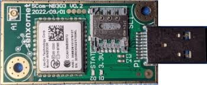
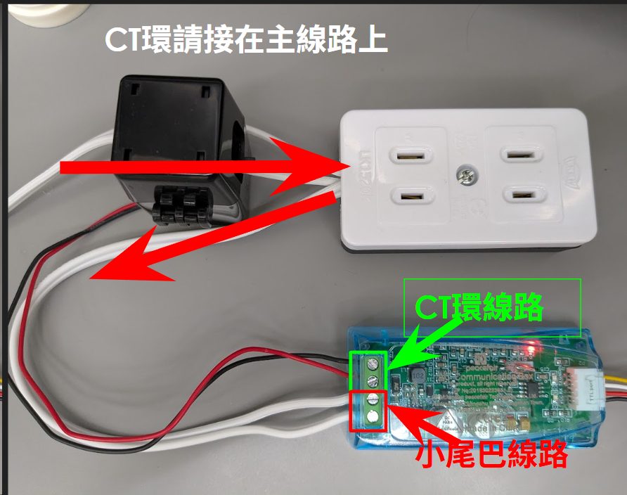
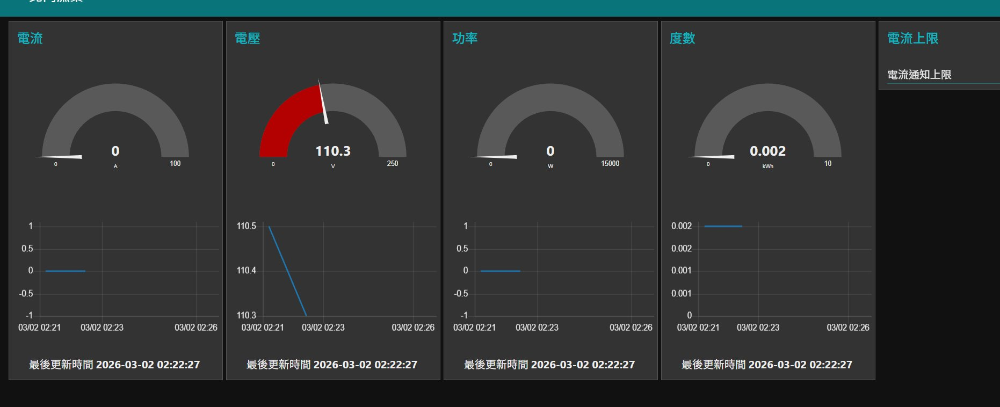
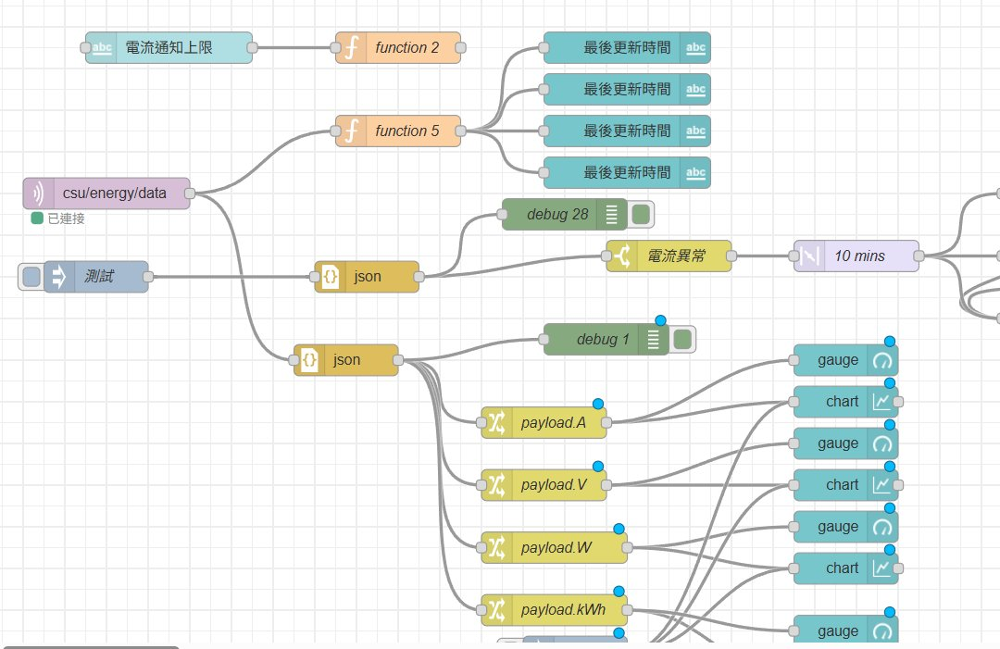

# STM32 NB-IoT Energy MQTT (v60)

NUCLEO-L053R8 專案：讀取能源模組資料並透過 NB-IoT 發送到 MQTT。

## 模組型號
- NB-IoT 模組：LiteON `NB303`
- 能源偵測模組：`PZEM004T`（你的描述為 PEZM004T）

## 模組照片
NB303 模組：



PZEM004T 模組：



## 功能
- NB-IoT 自動初始化與連線
- 能源模組讀值（SoftwareSerial）
- 每 60 秒發送一次 JSON 到 MQTT topic `csu/energy/data`
- 若能源讀值失敗，不等 60 秒，改為每 2 秒重試直到成功
- 若 MQTT 發送失敗，自動回到 ATI 起始流程重連

## 硬體
- Board: `NUCLEO-L053R8`
- NB-IoT UART: `USART1`
  - MCU TX `D8(PA9)` -> NB RX
  - MCU RX `D2(PA10)` <- NB TX
  - `GND` 共地
- NB-IoT 電源控制:
  - `D7(PA8)` (LOW 關機、5 秒後 HIGH 開機)
- 能源模組 UART: `SoftwareSerial`
  - MCU RX `D4` <- Energy TX
  - MCU TX `D5` -> Energy RX
  - `GND` 共地
- Debug UART:
  - ST-LINK VCP `COM13 @ 115200`

## MQTT 設定
- Domain: `mqttgo.io`
- IP: `218.161.43.149`
- Port: `1883`
- Client ID: `6545451212`
- Topic: `csu/energy/data`

發送 JSON 範例:
```json
{"A":0.123,"V":115.0,"W":15.2,"kWh":0.503}
```

## 啟動流程
1. `ATI` 確認模組
2. `AT+CEREG?` 每 5 秒檢查註網，最長 300 秒
3. `AT+EDNS="mqttgo.io"`
4. `AT+EMQNEW=218.161.43.149,1883,60000,1024`
5. `AT+EMQCON=0,3.1,"6545451212",60000,0,0,"",""`
6. 進入週期上傳模式

## 建置與燒錄 (PlatformIO)
```powershell
python -m platformio run -t upload
```

## 除錯輸出
打開 `COM13` 可看到:
- `[STEP ...]` NB-IoT 初始化與連線狀態
- `[ENERGY] ...` 讀值結果
- `[STEP EMQPUB] OK/FAIL` MQTT 發送結果
- `[RECOVER] ...` 自動恢復原因

## 專案重點檔案
- `src/main.cpp`: 主流程與狀態控制
- `platformio.ini`: 平台與上傳設定

## Node-RED 成果
Node-RED Dashboard 顯示（電流/電壓/功率/度數）：



Node-RED Flow（MQTT topic `csu/energy/data` 解析與儀表板）：


